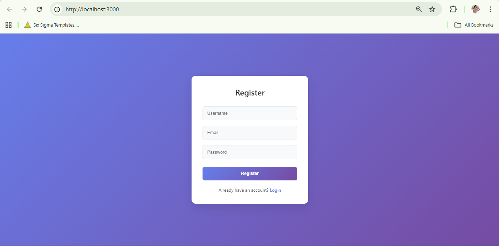
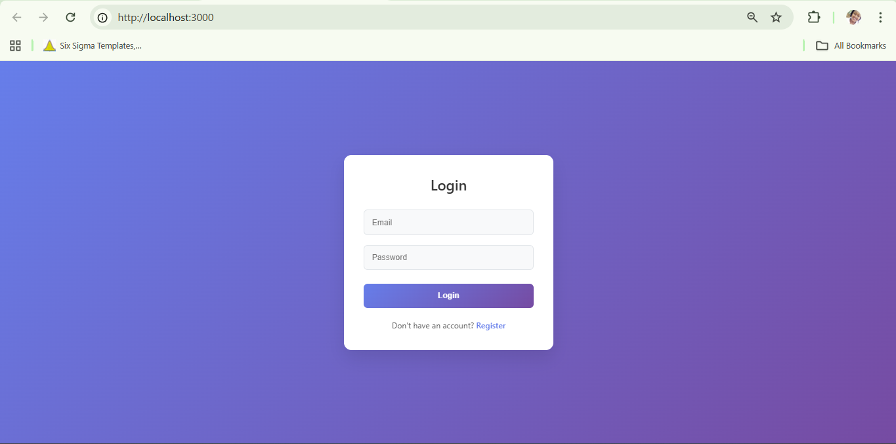
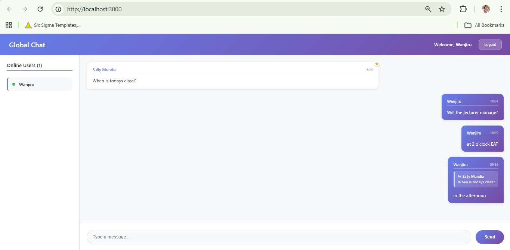
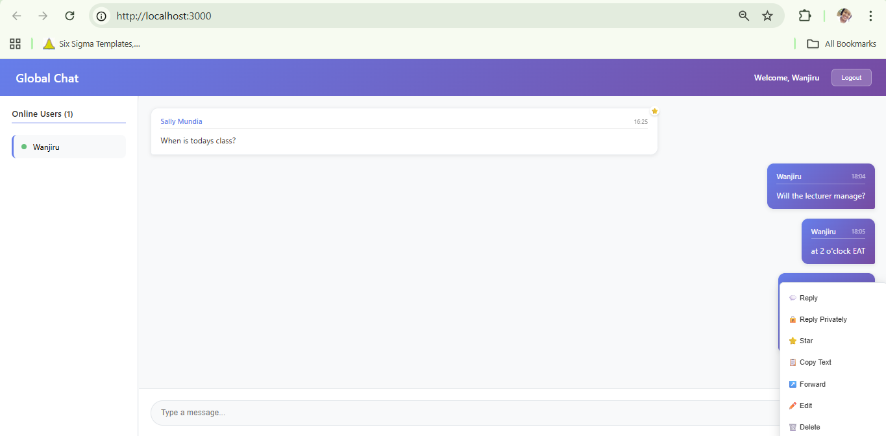
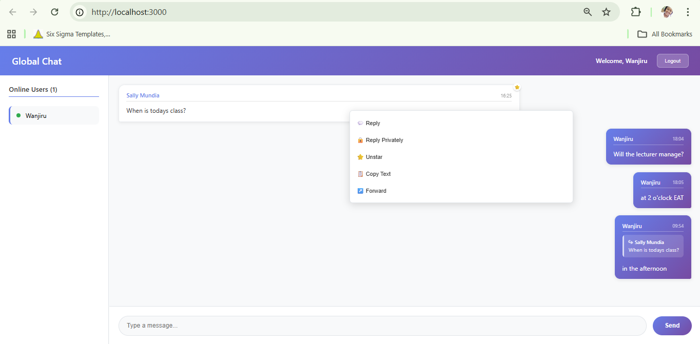
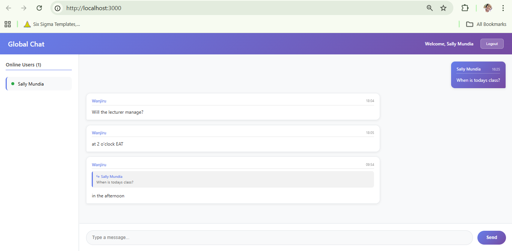

# Real-Time Chat Application with Socket.io
## Real-Time Chat Application (Socket.io + MERN)

This repository contains a real-time chat application built with a React front-end and a Node/Express + Socket.io back-end. It demonstrates bidirectional real-time messaging, user presence, message operations (reply, star, edit, delete), private messaging, and additional UX improvements and is a requirement of my week 5 assignment in my specialization as a full stack MERN developer.

---

## Project overview

- Frontend: React (client/) — real-time UI, context providers, custom hooks, and a message context menu
- Backend: Node.js + Express (server/) — REST endpoints, Socket.io handlers, MongoDB models
- Communication: Socket.io for real-time events (messages, typing, presence, notifications)

This app was created as a learning project and includes several advanced chat features described below.

## Repository structure

```
socket-io-chat-app/
├── .git/                   # Git repository metadata
├── .history/               # Local history files
├── client/                 # React front-end application
│   ├── public/             # Static files
│   │   └── index.html      # Main HTML template
│   ├── src/                # React source code
│   │   ├── components/     # UI components
│   │   │   ├── ChatRoom.jsx           # Main chat interface
│   │   │   ├── Login.jsx              # Login/Register component
│   │   │   └── MessageContextMenu.jsx # Right-click context menu
│   │   ├── context/        # React context providers
│   │   │   └── AuthContext.jsx        # Authentication context
│   │   ├── hooks/          # Custom React hooks
│   │   │   ├── useMessageContextMenu.js  # Context menu hook
│   │   │   └── useNotifications.js       # Browser notifications hook
│   │   ├── socket/         # Socket.io client configuration
│   │   │   └── socket.js   # Socket client setup
│   │   ├── App.css         # Global styles
│   │   ├── App.jsx         # Main app component
│   │   └── index.js        # React entry point
│   ├── package.json        # Client dependencies and scripts
│   └── package-lock.json   # Dependency lock file
├── server/                 # Express + Socket.io server
│   ├── middleware/         # Express middleware
│   │   └── auth.js         # Socket authentication middleware
│   ├── models/             # Mongoose database models
│   │   ├── Message.js      # Chat message model
│   │   └── user.js         # User model
│   ├── routes/             # Express API routes
│   │   └── auth.js         # Authentication routes
│   ├── socket/             # Socket.io event handlers
│   │   └── ChatHandlers.js # Chat-related socket events
│   ├── .env                # Environment variables (not in git)
│   ├── server.js           # Server entry point
│   ├── package.json        # Server dependencies and scripts
│   └── package-lock.json   # Dependency lock file
├── screenshots/            # Application screenshots
│   ├── advancedfeature1.png
│   ├── advancedfeature2.png
│   ├── advancedfeature3-online-status.png
│   ├── chatsection.png
│   ├── loginpage.png
│   └── registerpage.png
├── Week5-Assignment.md     # Assignment instructions
└── README.md               # This documentation file
```

---

## Advanced features implemented

- Real-time messaging with Socket.io
- User authentication and presence tracking (isOnline, lastSeen)
- Message history per room and private messages
- Typing indicators and stop-typing events
- Message actions via context menu: Reply, Reply privately, Star/Unstar, Copy, Forward
- Reply-to-message feature with reply preview and clickable reply previews (scrolls and highlights original message)
- Message edit and delete
- Message starring (star/unstar) with per-user state
- Desktop/notification hooks when receiving messages or presence changes
- Graceful server shutdown and error handling

---

## Setup (local development)

Follow these steps to run the project locally. Commands assume you're in the repository root.

1) Prerequisites

- Node.js (v18+ recommended) and npm installed
- MongoDB running locally (or a cloud MongoDB URI)

2) Server

```powershell
cd server
# install server deps
npm install

# create a .env file in server/ with at least:
#  MONGODB_URI=mongodb://localhost:27017/chat-app
#  JWT_SECRET=your_jwt_secret
#  PORT=5000

# start server in dev mode (uses nodemon)
npm run dev
```

3) Client

```powershell
cd client
npm install

# start client in development (React dev server)
npm start
```

Open the client in your browser (usually http://localhost:3000). The client will connect to the server (default http://localhost:5000). If your server runs on another origin, set the `CLIENT_URL` and client socket url accordingly in your environment and client socket setup.

Notes:
- If `package.json` contains `"type": "module"` the server uses ES modules; ensure imports/exports use `import`/`export` or rename server files to `.cjs` for CommonJS.
- If you see `ERR_CONNECTION_REFUSED` on socket.io endpoints, confirm the server is running and that client socket is pointed at the correct origin/port.

---

## Environment variables

Add a `.env` file to the `server/` folder with values like:

```
MONGODB_URI=mongodb://localhost:27017/chat-app
JWT_SECRET=replace_with_a_secure_secret
PORT=5000
CLIENT_URL=http://localhost:3000
```

---

## How reply highlighting works (quick note for maintainers)

- When a message is replied to, the message object contains a `repliedTo` field (either an id or an object depending on server serialization).
- The client shows a condensed reply preview inside the replying message and allows clicking the preview to scroll to and temporarily highlight the original message.
- The CSS class `highlighted-message` runs a brief pulse animation to make the origin obvious.

---

## Screenshots













---

## Deployed URLs (placeholders)

- Server (Railway): https://your-chat-server.railway.app
- Client (GitHub Pages): https://your-username.github.io/your-repo

---

## Troubleshooting

- ERR_CONNECTION_REFUSED when connecting to Socket.io:
  - Ensure `server` is running (check `npm run dev` or `node server.js`).
  - Confirm server port matches the client socket URL.
- "require is not defined in ES module scope" errors:
  - Either convert files to ES module imports (use `import`) or remove `"type": "module"` from the `package.json` and use CommonJS (`require`).
- CORS issues:
  - Make sure the server CORS settings allow the client origin (set via `CLIENT_URL` env var).

---

## Development notes & next steps

- Add unit/integration tests for socket handlers and React components
- Add message delivery/read receipts
- Add persistence for starred messages per-user (if not already persisted)
- Improve accessibility (keyboard context menu, ARIA labels)

---

Happy coding! by Salome Mundia